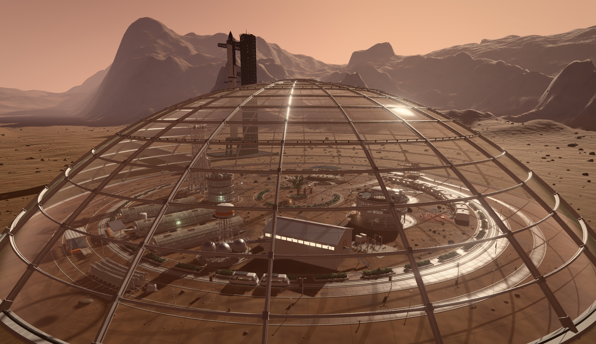

# Elysium Planitia — Mars Park

Step off the tram into the first park on another world. Under a 260-metre glass
dome on the Elysium Planitia flats, five hectares of paved plaza, working
farm and quiet terrace sit inside a ring of red mountains you can see from
anywhere in it — a whole small town's worth of place, rendered in real time and
walked in first person at true Martian gravity. Every rivet of it is generated
by code: the gridshell overhead, the regolith underfoot, the lettuce on the
greenhouse benches, the dust the washer robot has not reached yet. There are no
menus, no meters and no monsters. There is a low frozen sun, a tram that comes
round every few minutes, and a planet on the other side of the glass.


***Play live at https://mars.scottsun.io***

---

## What it is

A WebGPU-only, first-person 3D experience built with **Three.js** and **TSL**
(Three.js Shading Language). It is not a demo scene: the park is a full world
system — architecture, transit, physics, vegetation, robots, weather and a
complete render pipeline — assembled from a single source-of-truth layout plan.

**Design canon**

| | |
|---|---|
| Setting | Elysium Planitia, ~3°N — a flat valley ringed by rocky hills |
| Dome One | Glass spherical cap, 260 m across, ~64 m at the crown |
| Structure | 24 flanged-girder ribs × 13 ring parallels; one uniform grammar |
| Interior | ~5 ha, plaza-centric: civic floor, transit boulevard, planted spokes |
| Time | A single frozen late afternoon — no day/night cycle, ever |
| Gravity | True 0.38 g, everywhere |
| UI | None, beyond contextual action prompts |

The frozen sun is the project's central rendering advantage: everything static
— sky, IBL, shadow clipmaps, the dome's lattice shadow net — is precomputed or
solved analytically rather than re-rendered.

**Districts.** A leisure heart (amphitheatre bowl, the Overlook Lounge, the
First Tree and its plaza, the fountain), a residential arc of habitat pods,
Farmside's three vaulted glasshouse ranges and the hydroponics tower, and The
Works — the life-support machinery, celebrated rather than hidden. The Loop, a
two-car automated people mover, runs the boulevard between them all day.

## Requirements

- A current Chrome, Edge or Safari on a **WebGPU-capable** GPU. There is no
  WebGL fallback by design.
- Node.js 22 or newer.

## Getting started

```bash
npm install
```

```bash
npm run dev
```

Open the printed URL, click **BOARD**, and the day begins in the front car of
an arriving tram.

Other scripts:

```bash
npm run build
```

```bash
npm run typecheck
```

```bash
npm run lint
```

## Controls

| Input | Action |
|---|---|
| `W` `A` `S` `D` | Walk |
| `Shift` | Sprint |
| `Space` | Jump (0.38 g — you will notice) |
| Mouse | Look (click the canvas to capture the pointer) |
| `E` | Contextual action — board, alight, sit, open, ride |
| `Esc` | Release the pointer — the park pauses; press again to resume |

## URL flags

The app reads a handful of query parameters, all optional:

| Flag | Meaning |
|---|---|
| `?debug` | Stats, timings, tweak panel and the `window.__elysium` console handle |
| `?view=<name>` | Fixed validation camera instead of the player — `arrival`, `firsttree`, `rim`, `panewalker`, `greenhouse`, `amphitheater`, `works`, `porch`, `fountain`, `jump`, `gallery` |
| `?pass=<name>` | Isolate one render pass — `nopost`, `ao`, `aoraw`, `aodenoised`, `nograde`, `shafts`, `depth`, `normal`, `shadows`, `bloom`, `haze` |
| `?tier=0..2` | Force a quality tier instead of auto-detecting |
| `?seed=<n>` | Override the world-generation seed |
| `?freeze` | Halt the park clock for a repeatable validation frame |

## Project layout

```
src/
  archkit/      procedural architecture toolkit — profiles, lofts, the audit gate
  audio/        fully synthesised ambience, point sources and footsteps
  core/         events, seeded RNG, quality state, debug flags, postcard cameras
  dome/         gridshell, glass shell, connector tube, interior haze
  exterior/     valley terrain, aerial perspective, the skyline beyond the glass
  fountain/     water simulation, surface optics, spray
  materials/    the shared procedural material library
  physics/      Rapier world, heightfield floor, dome containment
  player/       locomotion, look, interaction, seat rigs
  procgen/      lower-level mesh kits ported from Blender-style toolchains
  render/       pipeline, GTAO, bloom, tone mapping, LUT grade, shadow clipmaps
  robots/       Optimus exhibit, the Panewalker glass washer, service units
  runtime/      system registry, fixed-step loop, game context
  sky/          sky radiance, sun, environment bake
  starship/     the launch site beyond the dome
  tram/         track, car body, interior, coupling, portal gate
  ui/           entry screen, pause menu, platform gate
  vegetation/   the First Tree, planters, gardens, crops, foliage materials
  world/        parkPlan (the layout source of truth), paving, districts, amenities
tools/          headless geometry and layout gates (node, no browser)
dev_docs/       system documentation and the accumulated build notes
```

## Architecture notes

- **`src/world/parkPlan.ts` is the single source of truth for layout.** Nothing
  else hardcodes a world position; paving, districts, vegetation, amenities and
  lighting all derive from it.
- **The runtime is a system registry**, not a monolith. `src/main.ts` wires
  systems in dependency order and `runtime/loop.ts` drives them on a fixed step
  with an interpolated render.
- **Geometry is authored, not boxed.** Anything with a silhouette goes through
  `archkit/meshdata.ts` (profiles, lofts, lathes, true fillets, smooth-by-angle
  normals) and lands in a merged per-material mesh via `archkit/writer.ts`.
- **Everything is checked headlessly.** `tools/*.mjs` build districts in Node
  and audit them — z-fighting, cross-slot clashes, degenerate faces, floating
  parts, layout overlaps, clearance envelopes — without launching a browser.

```bash
node --experimental-strip-types tools/archkit-selftest.mjs
```

## Documentation

`dev_docs/` carries the design canon (`design.md`, `plan.md`), one document per
system under `dev_docs/systems/`, craft guides under `dev_docs/craft/`, and
`dev_docs/notes.md` — a running log of every trap the build has hit and how it
was solved. Read the notes before touching geometry.
